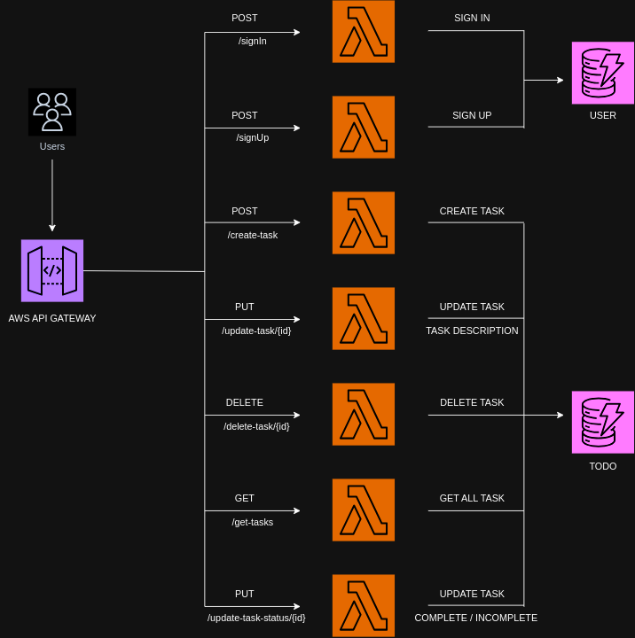

# 📝 Todo Application

This is a Todo application where the backend is written in Golang, using AWS Lambda for business logic, DynamoDB for data persistence, and API Gateway to provide the HTTP endpoints to access and use the application. The infrastructure is deployed using AWS CDK with Go bindings.

## ✨ Features

- Add, Update, and Delete Todo items.
- Login and Register Endpoints with JWT Auth
- Mark Todo items as complete or incomplete.
- Retrieve all Todo items.

## 🛠️ Technologies Used

- Backend: Golang (AWS Lambda)
- Database: DynamoDB
- API Management: AWS API Gateway
- Infrastructure: AWS CDK (Go bindings)

## 🚀 Getting Started

### 📋 Prerequisites

#### AWS Setup
- AWS account with appropriate permissions.
- AWS CLI configured with your credentials.

#### Local Setup
- Golang installed on your machine.
- AWS CDK installed.

### 🏃‍♂️ Running the Application

1. Clone this repository:

    ```bash
    git clone https://github.com/Sahil-4555/GOLANG_SERVERLESS.git
    ```

#### AWS CDK Deployment

1. Set the root user login with AWS:

    ```
    aws configure
    ```
2. Navigate to the CDK directory:

    ```
    cd cdk
    ```
3. Bootstrap the CDK environment:

    ```
    cdk bootstrap
    ```
4. Deploy the CDK stack:

    ```
    cdk deploy
    ```
#### Architecture




### 🏗️ Project Structure

- `cdk/`: Contains the AWS CDK infrastructure code.
- `lambda/`: Contains the Lambda function code.

### 📂 File Structure

```
.
├── cdk
│   ├── cdk.go
│   ├── cdk.json
│   ├── go.mod
│   └── go.sum
├── complete-task
│   └── main.go
├── create-task
│   └── main.go
├── db
│   ├── task_db.go
│   └── user_db.go
├── delete-task
│   └── main.go
├── get-tasks
│   └── main.go
├── go.mod
├── go.sum
├── readme.md
├── sign-in
│   └── main.go
├── sign-up
│   └── main.go
├── tree_structure.txt
├── update-task
│   └── main.go
└── utils
    ├── constants
    │   └── constants.go
    ├── crypto
    │   └── auth.go
    └── middleware
        └── middleware.go
```

The project directory structure embodies a modular design where each directory serves a distinct purpose. The `cdk/` directory orchestrates AWS CDK infrastructure setup, while individual directories like `complete-task/`, `create-task/`, and `delete-task/` house Lambda functions responsible for specific CRUD operations on tasks. The `db/` directory encapsulates database interaction logic, and `utils/` contains utility functions.
